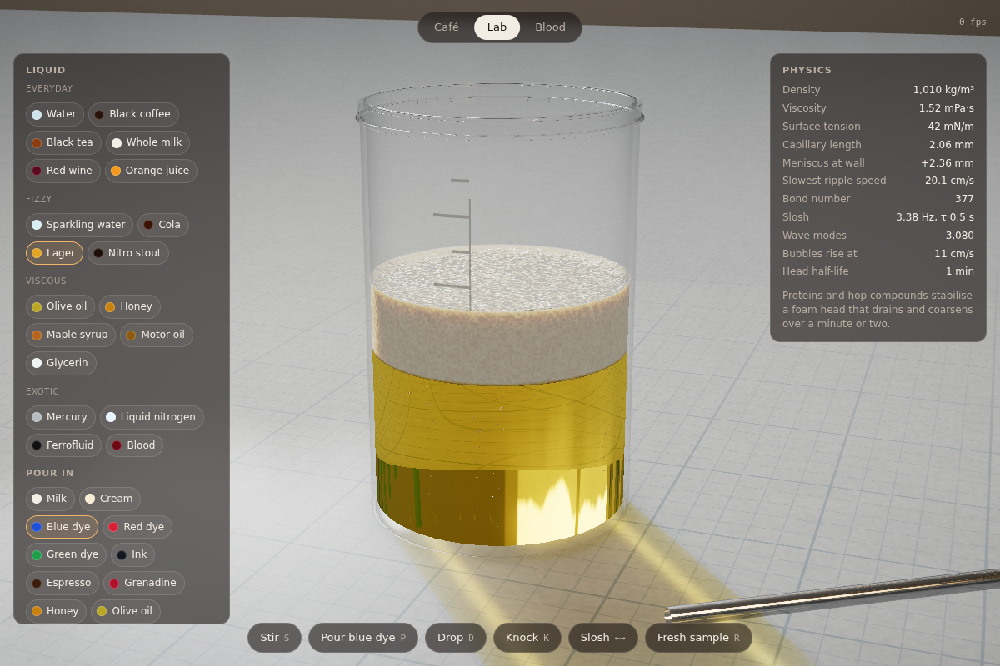
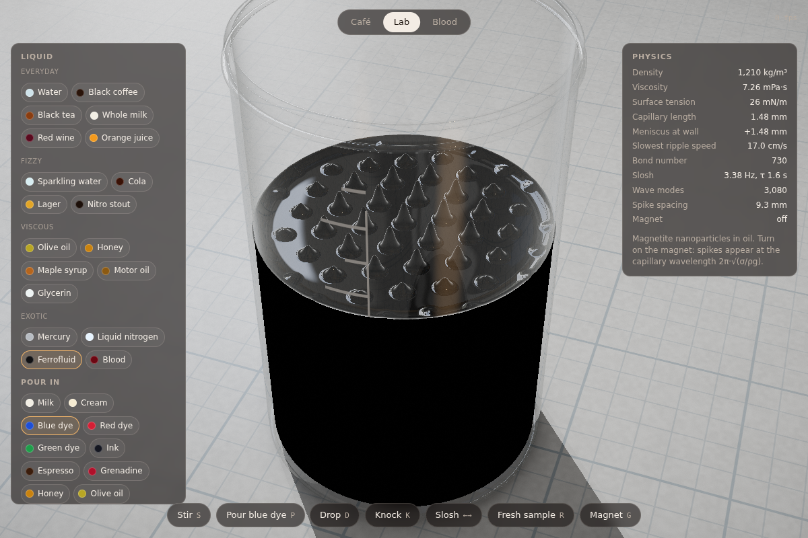
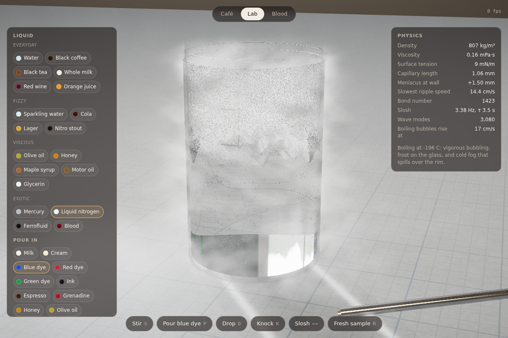
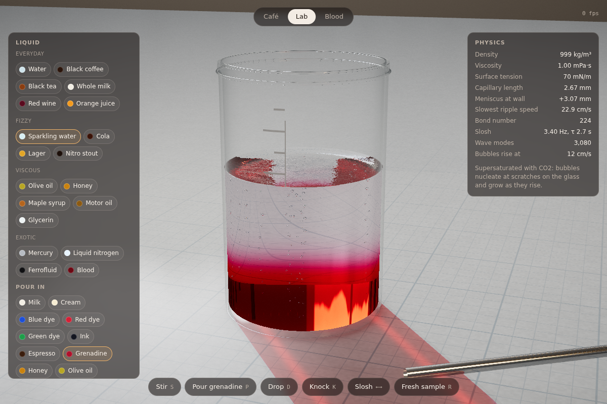
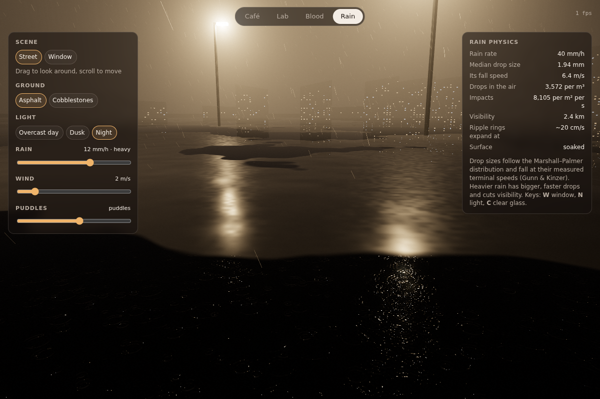
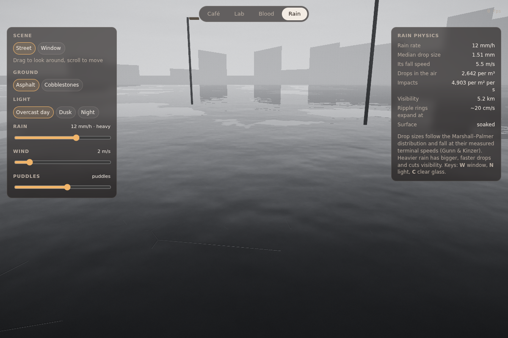
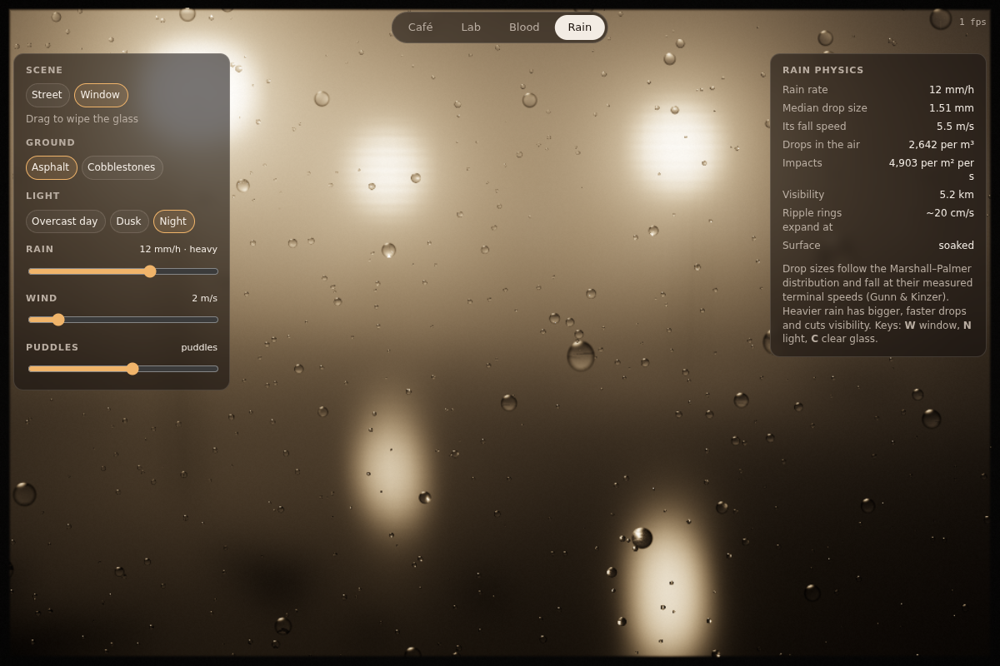

# Coffee — a physically based liquid simulation

A cup of coffee on a wooden table, rendered in real time with WebGL2. Stir it, pour in milk, drop sugar in, knock the table or slide the cup to slosh it.

No build step or dependencies. Serve the folder and open `index.html`:

```sh
npx http-server .     # or: python3 -m http.server
```

Requires WebGL2 with `EXT_color_buffer_float`, which any recent desktop or mobile browser has.

The app has four tabs:

- **Café** (`index.html`): a cup of coffee on a wooden table.
- **Lab** (`lab.html`): a glass beaker for testing different liquids — see [The lab](#the-lab).
- **Blood** (`blood.html`): blood on surfaces, for games — see [Blood mechanics](#blood-mechanics).
- **Rain** (`rain.html`): a street in the rain, and the same street through a rainy window — see [Rain](#rain).

## Controls

| Action | Input |
| --- | --- |
| Stir with the spoon | drag on the coffee |
| Drop a droplet | tap the coffee |
| Slide the cup (sloshing) | drag the cup or saucer, or use the arrow keys |
| Orbit / zoom | drag the background (or right-drag), scroll |
| Stir / milk / sugar / knock / reset | `S` `M` `D` `K` `R` or the buttons |

## What's simulated

**Free-surface waves: exact modal solution for a cylindrical cup** (`src/modal.js`)
The coffee surface is expanded in the eigenmodes of a cylinder, `J_m(k r)·cos/sin(mθ)`, with `k R` the zeros of `J_m'` (no flow through the wall). That gives about 3,000 modes up to `kR = 110`, down to wavelengths of about 2 mm. Each mode is a damped oscillator with the full gravity–capillary finite-depth dispersion relation:

    ω² = (g k + σ/ρ k³) tanh(k H)

Each oscillator is advanced with its exact propagator, so it is unconditionally stable even for the ~170 Hz capillary modes. The following all fall out of the physics:
- the 3.4 Hz fundamental slosh of an 8 cm mug
- capillary ripples running ahead of gravity waves after a drop
- ring waves converging after a knock
- reflections off the wall

Damping per mode comes from bulk viscosity, the inextensible surfactant film on coffee, the wall and bottom Stokes layers, and contact-line losses. Moving the cup applies the fictitious force in the cup's frame, projected onto the m = 1 modes.

Beyond linear theory:
- **Waves ride the swirl.** Every mode is Doppler-rotated by the mean angular velocity of the surface flow, `Ω = Σ u_θ r² / Σ r³`, so ripples are carried round a stirred cup.
- **Stokes crests.** A second-order correction `η₂ = k̄ (η² − ⟨η²⟩)` sharpens crests and flattens troughs as the waves steepen.
- **Breaking.** When the RMS slope passes about 0.28, the waves lose energy, short ones first (weighted by `(k/k̄)²`), and throw off foam bubbles. The whole field is no longer squashed.
- **Spilling.** A crest that overtops the rim is lost from the wave field. It leaves coffee running down the outside of the mug in rivulets, with beads at their ends, and a puddle on the saucer on the side where it went over.

**Surface flow** (`src/shaders.js`: `advectVel` … `grad`)
A 2D stable-fluids solver on the GPU runs inside the circular domain:
- free-slip walls with vorticity confinement
- the spoon drags the liquid with it
- spin-down on a ~20 s timescale
- a 5-level multigrid V-cycle for the pressure solve, so the flow is properly divergence-free
- time-step-independent diffusion

The azimuthally averaged swirl is read back and integrated as `dη/dr = u_θ²/(g r)` to produce the vortex dip of stirred coffee. Pouring milk injects a divergent upwelling source, because milk that plunges in resurfaces and spreads, plus turbulence. MacCormack advection keeps the milk clouds sharp.

**Other effects**
- A static capillary meniscus climbs the wall (capillary length ≈ 2.3 mm).
- Floating bubbles are ray-traced thin-film domes (spherical caps) with a meniscus skirt at the foot. They are carried by the flow. They cluster against the wall (capillary attraction up the meniscus) and migrate into the eye of a vortex.
- A wet film is left on the wall when the coffee sloshes. It drains, and a faint tide mark stays at the resting line.

## Rendering

- **Reflections:** reflection rays from the coffee (and from bubbles and the spoon) are traced analytically against the cup's interior cylinder. You see the real cup wall and rim in the liquid, and the window beyond.
- **Black coffee:** Beer–Lambert absorption, strongest at blue wavelengths. The white wall shows through as an amber ring where the liquid thins at the meniscus.
- **Milk:** Kubelka–Munk diffuse reflectance from the mixed absorption and scattering coefficients, so a splash of milk goes café-au-lait by physics, not by a colour ramp.
- **Lighting:** a procedural room — a daylight window with mullions and a tungsten lamp — lights everything. The cup casts analytic soft shadows on the saucer and table, and the rim shadows the inside of the cup.
- **Scene materials:** glazed ceramic, varnished wood and a polished steel teaspoon.
- **Steam:** ray-marched, back-lit by the window with a Henyey–Greenstein phase function.
- **Post-processing:** HDR rendering with 4× MSAA, bloom, an ACES filmic tone map, vignette and grain.
- **Performance:** resolution adapts automatically on slower GPUs.

## The lab

A 400 ml borosilicate beaker on a lab bench. Pick a base liquid and something to pour in, then stir, drop, knock or slosh it.

**Base liquids, each with its real density, viscosity, surface tension, refractive index, contact angle and absorption and scattering spectra.** There are 19, in four groups:
- **Everyday:** water, black coffee, black tea, whole milk, red wine, orange juice.
- **Fizzy:** sparkling water, cola, lager, nitro stout.
- **Viscous:** olive oil, honey, maple syrup, motor oil, glycerin.
- **Exotic:** mercury, liquid nitrogen, ferrofluid, blood.

The wave solver is rebuilt for each liquid, so they genuinely behave differently:
- **Water:** long-lived ripples.
- **Honey and glycerin:** every mode is over-damped (the propagator handles this exactly), so the surface creeps instead of rippling.
- **Mercury:** a liquid-metal mirror with 7× water's surface tension. It has a convex meniscus because it doesn't wet glass.

**Special behaviour:**
- **Gas bubbles:** fizzy drinks carry rising streams of CO₂ bubbles from nucleation sites on the bottom and wall. Each bubble grows as it rises, at a rise speed set by Stokes' law or the inertial limit. Each shows the bright silvery rim that total internal reflection gives a gas bubble in liquid, and bursting bubbles keep the surface prickling.
- **Foam heads:** beer and cola pour with a head that decays with its own half-life, from seconds for cola to minutes for nitro stout. The head damps the waves. Stirring, or pouring something in, whips up more.
- **Liquid nitrogen:** it boils violently and frosts the outside of the glass below the liquid line. A dense cold fog fills the headspace, spills over the rim, and pools on the bench. Hot coffee and tea steam instead.
- **Ferrofluid:** turn on the magnet (`G`) and the surface rises into the hexagonal Rosensweig spike pattern. The spike spacing is the capillary wavelength 2π·√(σ/ρg), so the gravity slider changes it too.

The **gravity** slider (Moon to Jupiter) and **fill** slider rebuild the modes too. The **Physics** panel shows the numbers that follow from the physics: capillary length, meniscus height, slowest ripple speed, Bond number, and slosh frequency and decay.

**Additives:** milk, cream, blue, red and green food dye, ink, espresso, grenadine, honey, and olive oil.
- Miscible ones mix in a real 3D flow (`src/mix3d.js`), described below.
- Grenadine and honey are much denser, so they fall straight through, hit the bottom, and spread out as a layer (a layered drink) until you stir them in.
- Olive oil floats as an immiscible golden layer that keeps sharp edges and calms the ripples.
- On mercury, everything floats as a film over the mirror.

Switching additive keeps whatever is already mixed in, and a floating oil layer stays put.

**3D mixing** (`src/mix3d.js`)
Under the surface, an incompressible Boussinesq flow runs on a 40×40×64 grid. It carries the additive's volume fraction on a finer 80×80×128 grid (1 mm cells). Both 3D grids are stored as tiled 2D texture atlases, so each pass is a single draw.
- **Pouring.** A pour enters as a turbulent round jet. It spreads at about 12°, and its centreline slows as it entrains water, since momentum flux is conserved. It carries unresolved eddies at about 25 % turbulence intensity, so milk billows into a cloud instead of falling as a thread. Dye goes in as separate drops, each punching in as a blob that rolls up into a sinking vortex ring and trails a thin filament.
- **Buoyancy.** `g' = g Δρ/ρ` makes denser additives sink and lighter ones rise. Cream floats up, grenadine slumps across the floor as a gravity current, and on mercury everything floats.
- **Laminar or turbulent.** Each additive has its own viscosity. A stream's Reynolds number (impact speed √(2gh) ≈ 1.7 m/s) decides how it goes in: milk billows as a turbulent plume, while cream goes in as a smooth laminar jet and honey falls as a coherent rope.
- **Viscosity of the mixture.** It follows the local composition, interpolated in log space as for sugar solutions, so a honey blob creeps as a lump, resists the rod, and keeps its edges.
- **Stirring.** The rod drags the liquid along its whole immersed length.
- **Friction.** Unresolved Ekman and Stewartson layers on the floor and wall spin the swirl down. Floor friction is also what drives the secondary "tea-leaf" circulation (inward along the bottom, up the middle), though at this resolution it is weak.
- **Pressure solve.** Red-black SOR under a rigid lid. The surface waves are handled by the modal solver.
- **Advection.** The additive is advected with MacCormack plus a monotone limiter.

The renderer samples the field trilinearly while it ray marches, adding a thin surface film from the 2D flow. Sub-grid filaments are advected by the local 3D velocity, blending two noise phases, so fine detail moves with the liquid instead of sliding through it.

Optically:
- **Schlieren.** Each additive has its own refractive index (grenadine 1.44, honey 1.49, milk 1.35). Rays bend along the mixture's index gradient (dn/ds = ∇n), so syrup going into water shimmers and warps the view through the glass, as it does in real life.
- **Light inside clouds.** A light volume is recomputed every step. For each grid cell it stores the mean additive fraction along six paths: towards the window, straight up, and four ways sideways to the glass, 12 samples each. The renderer applies the exact path lengths, lighting each point by the window plus the easiest diffuse path in. Shadows under clouds come out smooth, and rendering does far fewer lookups. Absorption uses the reduced scattering coefficient μs′ = μs(1 − g). Its path-length enhancement goes from ~(1 + μs′L/2) in thin haze to the diffusion limit √(3μs′/μa) in thick media. Without this, the water's red absorption and the milk's blue absorption tint diluted milk green.

**Rendering:** because the beaker is glass, the liquid is rendered volumetrically by ray marching through it. This gives:
- Beer–Lambert absorption plus a Kubelka–Munk multiple-scattering source term
- refraction at every interface
- the silvery total-internal-reflection band at the bottom
- an inverted, lens-distorted view of the room through the liquid
- a stirring rod that looks bent where it enters the liquid
- a coloured shadow and cylindrical-lens caustic on the gridded bench mat

## Blood mechanics

A 30 × 30 cm patch of surface you can tilt from floor to wall. It's built for studying how blood should look and behave in games.

**Tools:**
- **Drip:** a single drop from a chosen height.
- **Bleed:** a steady ooze.
- **Arterial spurt:** a pulsatile jet at 75 bpm.
- **Impact spatter:** drag to set the direction and strength of a blow.
- **Cast-off:** flung off a swung object in a line.
- **Smear:** wipe through wet blood.

**Surfaces:** glazed tile (blood runs into the grout), concrete (porous), varnished wood (wicks along the grain), cotton fabric (soaks in fast and wicks outwards), and brushed steel.

**What's simulated:**
- **Thin-film flow:** a lubrication-equation solver on the surface, driven by gravity along and into the slope. The substrate's relief matters, so grout lines, pores and grain channel the blood.
- **Blood rheology:** blood is shear-thinning (Carreau–Yasuda, Cho & Kensey 1991), from 56 mPa·s at rest down to 3.5 mPa·s. It also has a small yield stress from red-cell rouleaux.
- **Contact lines:** thin films can't creep onto dry surface, and advancing contact lines are strongly damped. So pools stop at a realistic thickness, and drips running down a wall leave a trail and then stop.
- **Drop impacts:** each droplet in flight is ballistic with air drag, and a released drop approaches its terminal velocity (~7.6 m/s). On impact:
  - stain diameter comes from the energy balance of Pasandideh-Fard et al.;
  - elongation follows the bloodstain-analysis rule W/L = sin α, with a tail pointing the way the drop travelled;
  - scalloped rims, spines and satellite droplets appear once the splash parameter K = Oh·Re^1.25 (Mundo et al.) exceeds a threshold that depends on the surface's roughness.

  The last impact's numbers appear in the side panel.
- **Porous surfaces:** they absorb blood into the pores, then wick it outwards by capillarity. Wood wicks anisotropically, along the grain.
- **Clotting and drying:** blood clots over minutes, stops flowing, and loses its mirror gloss. Clot retraction leaves a straw-coloured serum rim. Evaporation, fastest at thin edges, leaves a coffee-ring deposit that browns as haemoglobin oxidises, and thick crusts crack. Use the time-scale slider to fast-forward.
- **Optics:** haemoglobin absorption and red-cell scattering are combined with two-layer Kubelka–Munk over the substrate, so thin smears are lighter red and thick pools are deep crimson. Arterial (oxygenated) blood is brighter than venous blood, and the wet film has gloss and a meniscus bulge.

## Rain

Two scenes, switched with the Scene buttons or `W`:
- **Street:** a road in the rain. Look around by dragging and move with the scroll wheel.
- **Window:** looking out through a rain-covered pane. Drag to wipe the glass.

**Controls:** rain rate (drizzle to downpour), wind, puddle level, asphalt or cobblestones, and overcast day, dusk or night (`N`).

**What's simulated:**
- **Drop sizes and fall speeds:** drops follow the Marshall–Palmer size distribution for the chosen rain rate, and each falls at its measured terminal velocity (Gunn & Kinzer). The side panel shows the median drop size, its fall speed, drops per m³, impacts per m² per second, and visibility.
- **Falling rain:** thousands of drops are drawn as motion-blurred streaks, each exactly one frame's travel long. Drops thinner than a pixel keep their true brightness by scaling their opacity. They look like the diffuse sky light they gather as tiny lenses, and sparkle with forward-scattered light near streetlamps.
- **Splashes:** every impact near the camera throws a crown of fine droplets.
- **Puddles:** water fills the low spots of the road's real relief, including the gaps between cobbles. Raindrops set off ripple rings on the puddles: wave packets expanding at the capillary–gravity group speed (~20 cm/s), a few millimetres of wavelength, decaying as they spread.
- **Wet surfaces:** rain soaks the road, which darkens porous surfaces and turns them glossy, then dries slowly after the rain stops. Streetlamps are reflected by microfacet (GGX) specular, so their reflections stretch into long streaks on the wet asphalt and break into glitter on rippling puddles.
- **Atmosphere:** rain and haze scatter lamplight with the closed-form single-scattering solution for a point light, which gives the glowing halos. Visibility falls with rain rate, so distant buildings fade.
- **The window:** drops hit the glass (more with wind), bead up and merge, and stay pinned until they grow past about 2 mm radius. Then they slide down in jerky zig-zags, swallowing the beads in their path and leaving trails of small droplets. Each drop is a lens showing a sharp, inverted image of the defocused street behind, with dark total-internal-reflection rims and glints.

## Screenshots

| Stirring | Milk | Droplet |
| --- | --- | --- |
|  |  |  |

| Lab: red dye in water | Lab: stirring honey | Lab: mercury |
| --- | --- | --- |
|  |  |  |

| Lab: lager with a head | Lab: ferrofluid spikes | Lab: liquid nitrogen | Lab: grenadine sinking |
| --- | --- | --- | --- |
|  |  |  |  |

| Blood: impact spatter | Blood: clotted pool, dried spatter | Blood: soaking into cotton |
| --- | --- | --- |
|  |  |  |

| Rain: night street | Rain: overcast day | Rain: on the window |
| --- | --- | --- |
|  |  |  |
