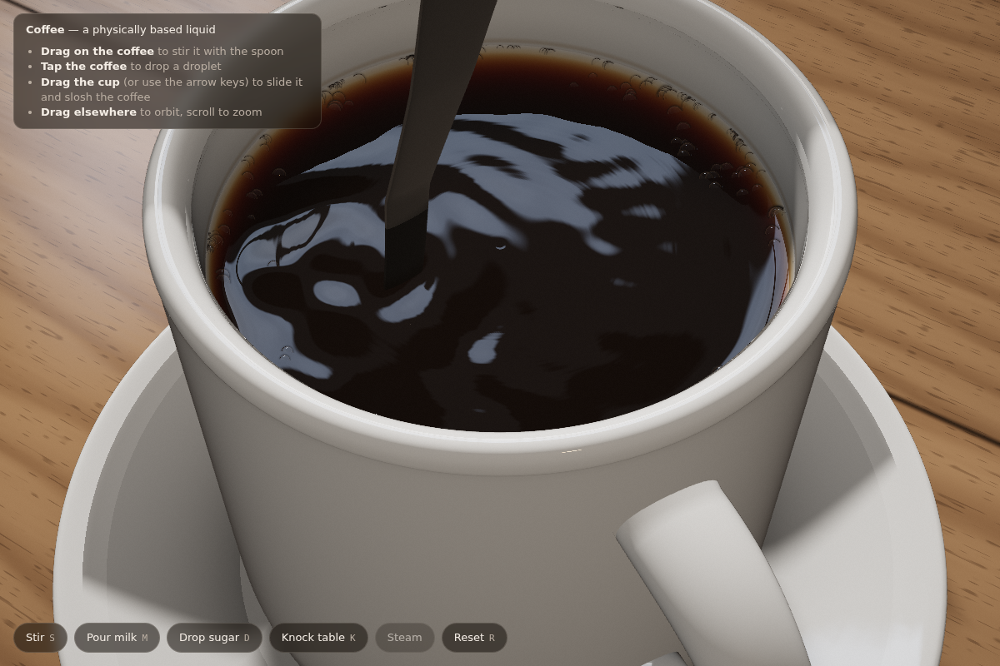
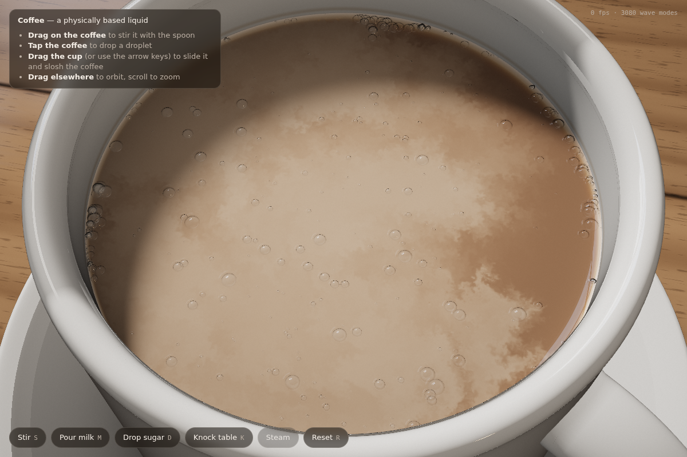
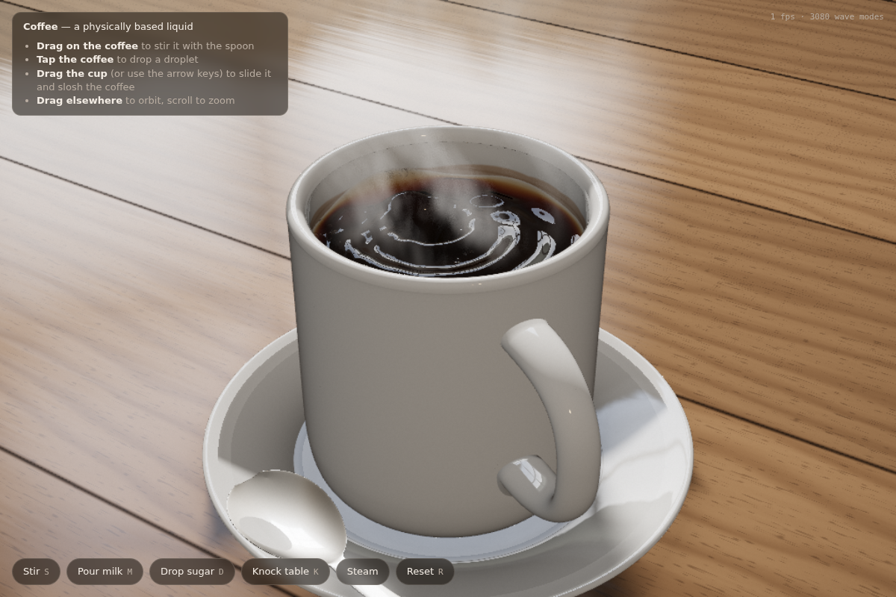
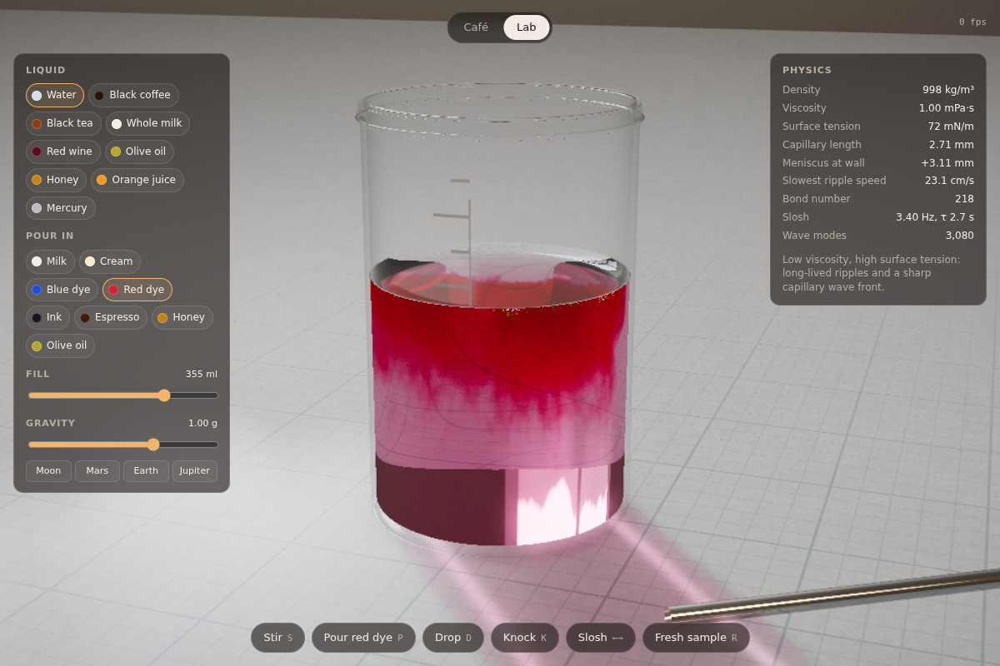
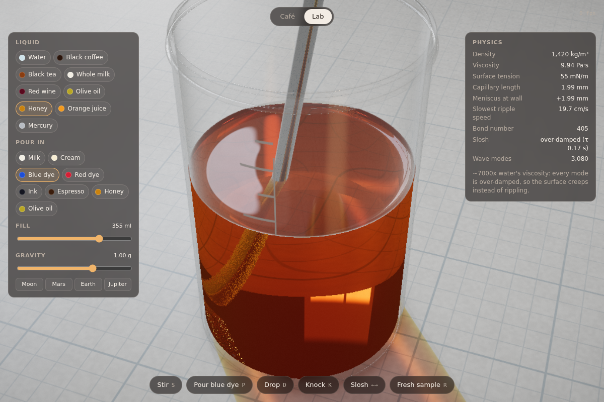
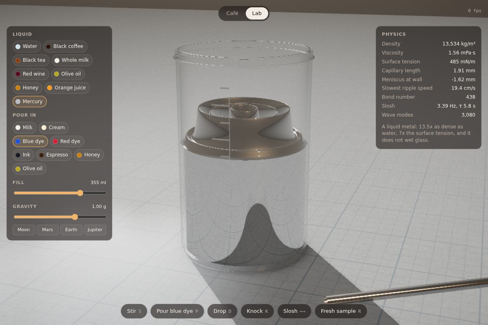
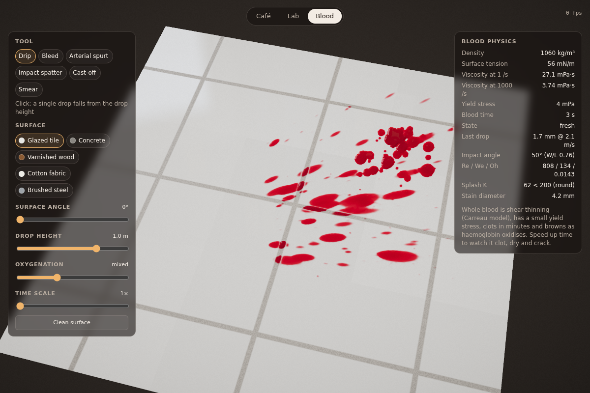
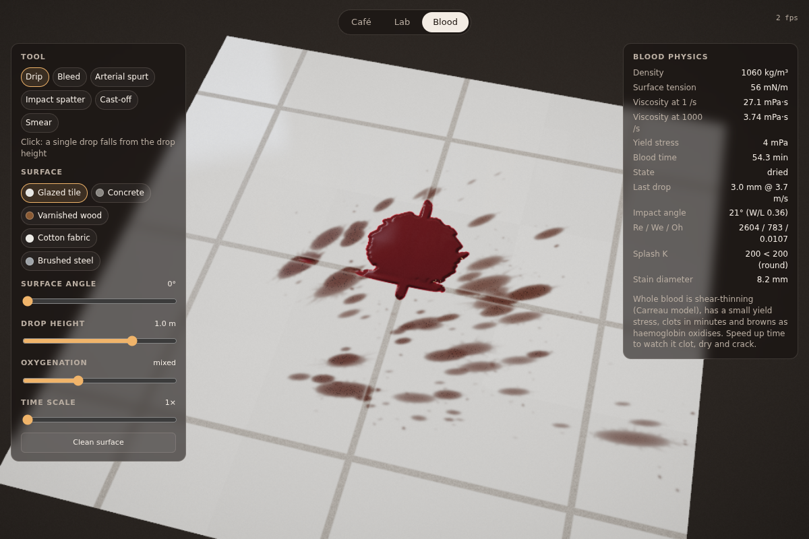
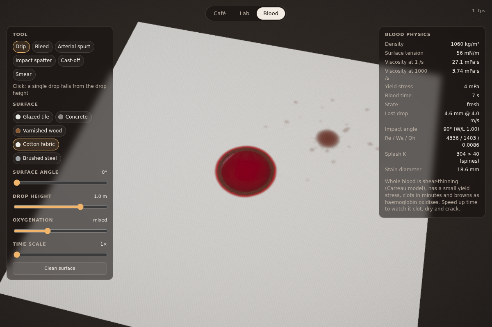

# Coffee — a physically based liquid simulation

A cup of coffee on a wooden table, rendered in real time with WebGL2. Stir it, pour in milk, drop sugar in, knock the table or slide the cup to slosh it.

No build step or dependencies. Serve the folder and open `index.html`:

```sh
npx http-server .     # or: python3 -m http.server
```

Requires WebGL2 with `EXT_color_buffer_float`, which any recent desktop or mobile browser has.

The page has two tabs:

- **Café** (`index.html`): a cup of coffee on a wooden table.
- **Lab** (`lab.html`): a glass beaker for testing different liquids — see [The lab](#the-lab).
- **Blood** (`blood.html`): blood on surfaces, for games — see [Blood mechanics](#blood-mechanics).

## Controls

| Action | Input |
| --- | --- |
| Stir with the spoon | drag on the coffee |
| Drop a droplet | tap the coffee |
| Slide the cup (sloshing) | drag the cup or saucer, or use the arrow keys |
| Orbit / zoom | drag the background (or right-drag), scroll |
| Stir / milk / sugar / knock / reset | `S` `M` `D` `K` `R` or the buttons |

## What's simulated

**Free-surface waves: exact modal solution for a cylindrical cup** (`src/modal.js`)
The coffee surface is expanded in the eigenmodes of a cylinder, `J_m(k r)·cos/sin(mθ)`, with `k R` the zeros of `J_m'` (no flow through the wall). That gives about 3,000 modes up to `kR = 110`, down to wavelengths of about 2 mm. Each mode is a damped oscillator with the full gravity–capillary finite-depth dispersion relation:

    ω² = (g k + σ/ρ k³) tanh(k H)

Each oscillator is advanced with its exact propagator, so it is unconditionally stable even for the ~170 Hz capillary modes. The following all fall out of the physics:
- the 3.4 Hz fundamental slosh of an 8 cm mug
- capillary ripples running ahead of gravity waves after a drop
- ring waves converging after a knock
- reflections off the wall

Damping per mode comes from bulk viscosity, the inextensible surfactant film on coffee, the wall and bottom Stokes layers, and contact-line losses. Moving the cup applies the fictitious force in the cup's frame, projected onto the m = 1 modes.

**Surface flow** (`src/shaders.js`: `advectVel` … `grad`)
A 2D stable-fluids solver on the GPU runs inside the circular domain:
- free-slip walls with vorticity confinement
- the spoon drags the liquid with it
- spin-down on a ~20 s timescale

The azimuthally averaged swirl is read back and integrated as `dη/dr = u_θ²/(g r)` to produce the vortex dip of stirred coffee. Pouring milk injects a divergent upwelling source, because milk that plunges in resurfaces and spreads, plus turbulence. MacCormack advection keeps the milk clouds sharp.

**Other effects**
- A static capillary meniscus climbs the wall (capillary length ≈ 2.3 mm).
- Floating bubbles are ray-traced thin-film domes (spherical caps) with a meniscus skirt at the foot. They are carried by the flow. They cluster against the wall (capillary attraction up the meniscus) and migrate into the eye of a vortex.
- A wet film is left on the wall when the coffee sloshes. It drains, and a faint tide mark stays at the resting line.

## Rendering

- **Reflections:** reflection rays from the coffee (and from bubbles and the spoon) are traced analytically against the cup's interior cylinder. You see the real cup wall and rim in the liquid, and the window beyond.
- **Black coffee:** Beer–Lambert absorption, strongest at blue wavelengths. The white wall shows through as an amber ring where the liquid thins at the meniscus.
- **Milk:** Kubelka–Munk diffuse reflectance from the mixed absorption and scattering coefficients, so a splash of milk goes café-au-lait by physics, not by a colour ramp.
- **Lighting:** a procedural room — a daylight window with mullions and a tungsten lamp — lights everything. The cup casts analytic soft shadows on the saucer and table, and the rim shadows the inside of the cup.
- **Scene materials:** glazed ceramic, varnished wood and a polished steel teaspoon.
- **Steam:** ray-marched, back-lit by the window with a Henyey–Greenstein phase function.
- **Post-processing:** HDR rendering with 4× MSAA, bloom, an ACES filmic tone map, vignette and grain.
- **Performance:** resolution adapts automatically on slower GPUs.

## The lab

A 400 ml borosilicate beaker on a lab bench. Pick a base liquid and something to pour in, then stir, drop, knock or slosh it.

**Base liquids, each with its real density, viscosity, surface tension, refractive index, contact angle and absorption and scattering spectra:**
water, black coffee, black tea, whole milk, red wine, olive oil, honey, orange juice, and mercury.

The wave solver is rebuilt for each liquid, so they genuinely behave differently:
- **Water:** long-lived ripples.
- **Honey:** every mode is over-damped (the propagator handles this exactly), so the surface creeps instead of rippling.
- **Mercury:** a liquid-metal mirror with 7× water's surface tension. It has a convex meniscus because it doesn't wet glass.

The **gravity** slider (Moon to Jupiter) and **fill** slider rebuild the modes too. The **Physics** panel shows the numbers that follow from the physics: capillary length, meniscus height, slowest ripple speed, Bond number, and slosh frequency and decay.

**Additives:** milk, cream, blue and red food dye, ink, espresso, honey, and olive oil.
- Miscible ones plume down in billowing tendrils and slowly mix into the bulk.
- Honey sinks as a falling stream and pools at the bottom until you stir it in.
- Oil floats as an immiscible layer that keeps sharp edges and calms the ripples.

Switching additive keeps whatever is already mixed in.

**Rendering:** because the beaker is glass, the liquid is rendered volumetrically by ray marching through it. This gives:
- Beer–Lambert absorption plus a Kubelka–Munk multiple-scattering source term
- refraction at every interface
- the silvery total-internal-reflection band at the bottom
- an inverted, lens-distorted view of the room through the liquid
- a stirring rod that looks bent where it enters the liquid
- a coloured shadow and cylindrical-lens caustic on the gridded bench mat

## Blood mechanics

A 30 × 30 cm patch of surface you can tilt from floor to wall. It's built for studying how blood should look and behave in games.

**Tools:**
- **Drip:** a single drop from a chosen height.
- **Bleed:** a steady ooze.
- **Arterial spurt:** a pulsatile jet at 75 bpm.
- **Impact spatter:** drag to set the direction and strength of a blow.
- **Cast-off:** flung off a swung object in a line.
- **Smear:** wipe through wet blood.

**Surfaces:** glazed tile (blood runs into the grout), concrete (porous), varnished wood (wicks along the grain), cotton fabric (soaks in fast and wicks outwards), and brushed steel.

**What's simulated:**
- **Thin-film flow:** a lubrication-equation solver on the surface, driven by gravity along and into the slope. The substrate's relief matters, so grout lines, pores and grain channel the blood.
- **Blood rheology:** blood is shear-thinning (Carreau–Yasuda, Cho & Kensey 1991), from 56 mPa·s at rest down to 3.5 mPa·s. It also has a small yield stress from red-cell rouleaux.
- **Contact lines:** thin films can't creep onto dry surface, and advancing contact lines are strongly damped. So pools stop at a realistic thickness, and drips running down a wall leave a trail and then stop.
- **Drop impacts:** each droplet in flight is ballistic with air drag, and a released drop approaches its terminal velocity (~7.6 m/s). On impact:
  - stain diameter comes from the energy balance of Pasandideh-Fard et al.;
  - elongation follows the bloodstain-analysis rule W/L = sin α, with a tail pointing the way the drop travelled;
  - scalloped rims, spines and satellite droplets appear once the splash parameter K = Oh·Re^1.25 (Mundo et al.) exceeds a threshold that depends on the surface's roughness.

  The last impact's numbers appear in the side panel.
- **Porous surfaces:** they absorb blood into the pores, then wick it outwards by capillarity. Wood wicks anisotropically, along the grain.
- **Clotting and drying:** blood clots over minutes, stops flowing, and loses its mirror gloss. Clot retraction leaves a straw-coloured serum rim. Evaporation, fastest at thin edges, leaves a coffee-ring deposit that browns as haemoglobin oxidises, and thick crusts crack. Use the time-scale slider to fast-forward.
- **Optics:** haemoglobin absorption and red-cell scattering are combined with two-layer Kubelka–Munk over the substrate, so thin smears are lighter red and thick pools are deep crimson. Arterial (oxygenated) blood is brighter than venous blood, and the wet film has gloss and a meniscus bulge.

## Screenshots

| Stirring | Milk | Droplet |
| --- | --- | --- |
|  |  |  |

| Lab: red dye in water | Lab: stirring honey | Lab: mercury |
| --- | --- | --- |
|  |  |  |

| Blood: impact spatter | Blood: clotted pool, dried spatter | Blood: soaking into cotton |
| --- | --- | --- |
|  |  |  |
